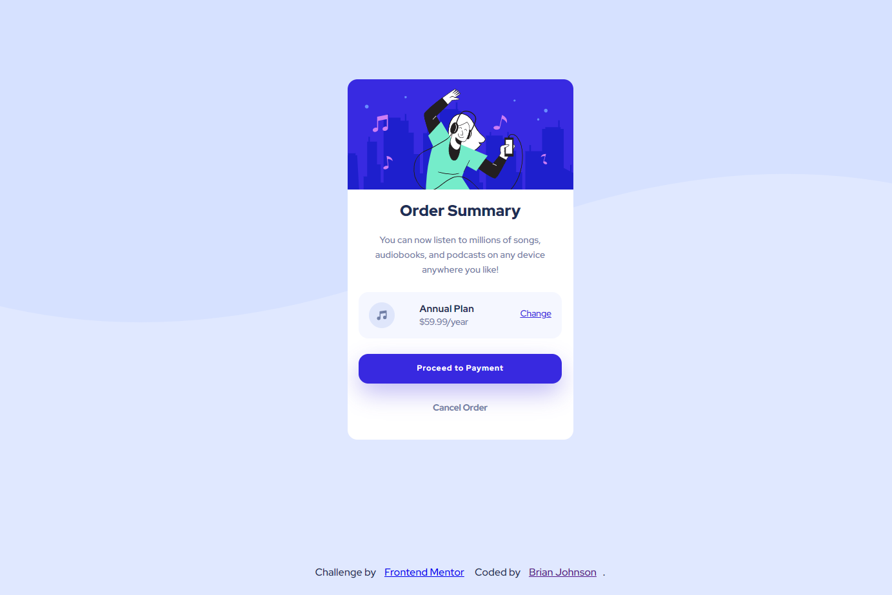

# Frontend Mentor - Order summary card solution

This is a solution to the [Order summary card challenge on Frontend Mentor](https://www.frontendmentor.io/challenges/order-summary-component-QlPmajDUj). Frontend Mentor challenges help you improve your coding skills by building realistic projects.

## Table of contents

- [Frontend Mentor - Order summary card solution](#frontend-mentor---order-summary-card-solution)
  - [Table of contents](#table-of-contents)
  - [Overview](#overview)
    - [The challenge](#the-challenge)
    - [Screenshot](#screenshot)
    - [Links](#links)
    - [Built with](#built-with)
    - [What I learned](#what-i-learned)
    - [Continued development](#continued-development)
  - [Author](#author)

## Overview

This was one of my first projects I started where I began using React.js and getting used to breaking out sections of code into components. Also started incorporating a sass architecture as well

### The challenge

The challenge for me was getting comfortable with background images and layout the HTML structure in accesible way.

### Screenshot



### Links

- Solution URL: [FEM Solution Link](https://www.frontendmentor.io/solutions/responsive-order-summary-component-using-reactjs-dbiR7cMy5)
- Live Site URL: [Deployed Project Link](https://order-summary-comp.herokuapp.com/)

### Built with

- Semantic HTML5 markup
- CSS custom properties
- Sass Architecture
- Flexbox
- CSS Grid
- Mobile-first workflow
- [React](https://reactjs.org/) - JS library

### What I learned

Use this section to recap over some of your major learnings while working through this project. Writing these out and providing code samples of areas you want to highlight is a great way to reinforce your own knowledge.

example of me adding a card component within my main tag

```js
function App() {
  return (
    <React.Fragment>
      <main className="container">
        <Card />
      </main>
      <Footer />
    </React.Fragment>
  );
}

export default App;
```

### Continued development

I want to continue to give focus on using React in my projects and getting comfortable breaking out pieces of code into components. I want to eventually start utilizing Styled components in addition to my Sass.

## Author

- Website - [Developer Portfolio](https://brianbjohnson.net/)
- Frontend Mentor - [FEM Profile Page](https://www.frontendmentor.io/profile/@BrianJ-27)
